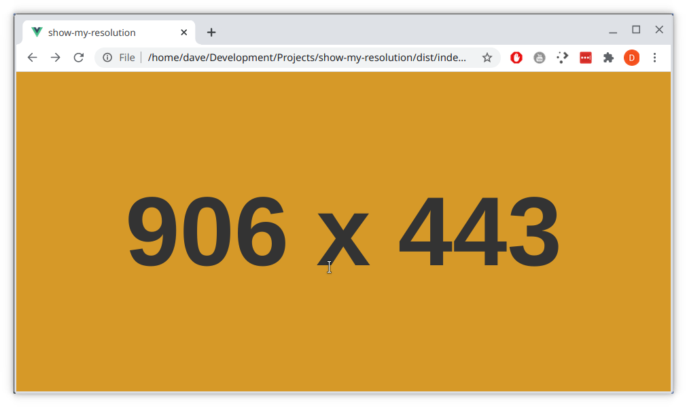

# show-my-resolution

Super simple Vue.js app to responsively show the current resolution of your browser window.

## Using

Just download the release (https://github.com/davekrejci/show-my-resolution/releases/tag/1.0) and open index.html in your browser. Voila!

